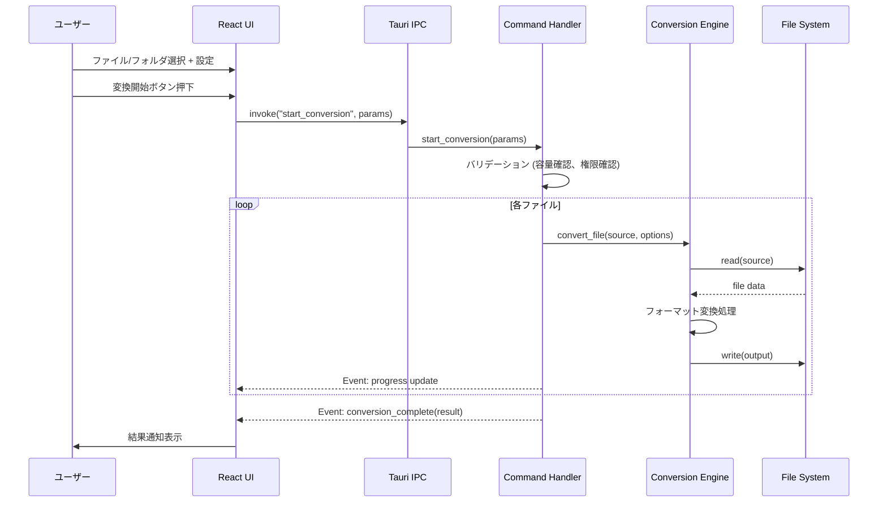
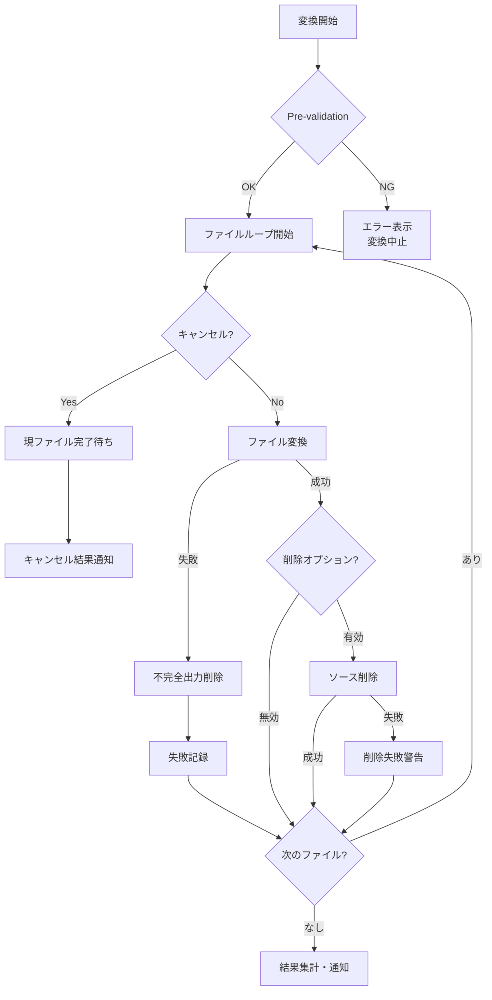

# Design Document: Universal File Converter

## Overview

Universal File Converter は、既存の WebPexer（WebP⇔PNG 変換デスクトップアプリ）を、汎用ファイル変換アプリとして1から再開発するプロジェクトである。Tauri 2.x（Rust バックエンド）+ React 18+ / TypeScript 5+ フロントエンドで構成し、画像・テキスト系ファイルの相互変換をサポートする。

### 設計方針

- **パフォーマンス優先**: ファイル変換処理は Rust バックエンドで実行し、UI スレッドをブロックしない
- **型安全性**: Tauri のコマンド機構による型付き IPC で、フロントエンド・バックエンド間の通信を安全に行う
- **拡張性**: Converter Trait により新規フォーマット対応を容易に追加可能
- **ユーザー体験**: Stripe ライクなミニマルデザインで、直感的な操作フローを提供

### 技術スタック

| レイヤー                   | 技術                                                   |
| -------------------------- | ------------------------------------------------------ |
| デスクトップフレームワーク | Tauri 2.x                                              |
| バックエンド               | Rust (tokio 非同期ランタイム)                          |
| フロントエンド             | React 18+ / TypeScript 5+                              |
| スタイリング               | TailwindCSS + HeadlessUI                               |
| 画像処理                   | `image` crate (0.25+)                                  |
| テキスト変換               | `serde_json`, `serde_yaml`, `toml`, `quick-xml`, `csv` |
| エンコーディング検出       | `encoding_rs`, `chardetng`                             |
| 国際化                     | i18next + react-i18next                                |
| データ永続化               | `@tauri-apps/plugin-store` (Key-Value ストア)          |
| ビルド                     | Vite (フロントエンド), Cargo (バックエンド)            |

---

## Architecture

### システムアーキテクチャ図

```mermaid
graph TB
    subgraph Frontend["フロントエンド (React + TypeScript)"]
        UI[UI Components<br/>TailwindCSS + HeadlessUI]
        State[State Management<br/>React Context + useReducer]
        I18n[i18next<br/>国際化]
        Store[Tauri Store Plugin<br/>設定・履歴永続化]
    end

    subgraph IPC["Tauri IPC Layer"]
        Commands[Tauri Commands<br/>invoke()]
        Events[Tauri Events<br/>進捗通知]
        Channel[Tauri Channel<br/>ストリーミング]
    end

    subgraph Backend["バックエンド (Rust)"]
        CmdHandler[Command Handlers]
        ConvEngine[Conversion Engine]
        ImageConv[Image Converter<br/>image crate]
        TextConv[Text Converter<br/>serde + csv]
        FileOps[File Operations<br/>tokio::fs]
        Validator[Validator<br/>入力検証]
    end

    subgraph OS["OS Layer"]
        FS[File System]
        Dialog[Native Dialogs]
    end

    UI --> State
    UI --> I18n
    State --> Commands
    State --> Store
    Commands --> CmdHandler
    Events --> UI
    Channel --> UI
    CmdHandler --> ConvEngine
    CmdHandler --> Validator
    ConvEngine --> ImageConv
    ConvEngine --> TextConv
    ConvEngine --> FileOps
    FileOps --> FS
    CmdHandler --> Dialog
    Dialog --> OS
```

### レイヤー構成

```mermaid
graph LR
    subgraph Presentation["プレゼンテーション層"]
        direction TB
        Pages[Pages]
        Components[Components]
        Hooks[Custom Hooks]
    end

    subgraph Application["アプリケーション層"]
        direction TB
        TauriCmd[Tauri Commands]
        EventBus[Event System]
        StoreAPI[Store API]
    end

    subgraph Domain["ドメイン層"]
        direction TB
        Converters[Converters]
        Validators[Validators]
        Models[Data Models]
    end

    subgraph Infrastructure["インフラ層"]
        direction TB
        FileIO[File I/O]
        Encoding[Encoding Detection]
        ImageLib[Image Processing]
    end

    Presentation --> Application
    Application --> Domain
    Domain --> Infrastructure
```



### データフロー（変換処理）



---

## Components and Interfaces

### バックエンド (Rust) コンポーネント

#### 1. Tauri Commands (IPC エントリポイント)

```rust
// src-tauri/src/commands/mod.rs

#[tauri::command]
async fn start_conversion(
    app: AppHandle,
    params: ConversionParams,
    channel: Channel<ProgressEvent>,
) -> Result<ConversionResult, ConversionError>;

#[tauri::command]
async fn cancel_conversion(app: AppHandle) -> Result<(), String>;

#[tauri::command]
async fn select_folder(app: AppHandle) -> Result<Option<String>, String>;

#[tauri::command]
async fn get_supported_formats(
    category: FormatCategory,
) -> Vec<FormatInfo>;

#[tauri::command]
async fn validate_output_path(path: String) -> Result<PathValidation, String>;

#[tauri::command]
async fn check_disk_space(
    input_paths: Vec<String>,
    output_path: String,
) -> Result<DiskSpaceCheck, String>;

#[tauri::command]
async fn get_conversion_history() -> Result<Vec<HistoryEntry>, String>;

#[tauri::command]
async fn clear_conversion_history() -> Result<(), String>;
```

#### 2. Conversion Engine (変換エンジン)

```rust
// src-tauri/src/converter/mod.rs

pub trait Converter: Send + Sync {
    fn supported_input_formats(&self) -> &[FileFormat];
    fn supported_output_formats(&self) -> &[FileFormat];
    fn can_convert(&self, from: &FileFormat, to: &FileFormat) -> bool;
    async fn convert(
        &self,
        input: &Path,
        output: &Path,
        options: &ConversionOptions,
    ) -> Result<(), ConversionError>;
}

pub struct ImageConverter;   // image crate ベース
pub struct TextConverter;    // serde ベース

pub struct ConversionEngine {
    converters: Vec<Box<dyn Converter>>,
    cancel_token: CancellationToken,
}
```

#### 3. Validator (入力検証)

```rust
// src-tauri/src/validator.rs

pub struct Validator;

impl Validator {
    pub fn validate_input_files(paths: &[PathBuf]) -> ValidationResult;
    pub fn validate_output_path(path: &Path) -> Result<(), ValidationError>;
    pub fn check_disk_space(input_size: u64, output_path: &Path) -> Result<(), ValidationError>;
    pub fn validate_file_size(path: &Path, max_size: u64) -> Result<(), ValidationError>;
}
```

### フロントエンド (React) コンポーネント

#### ページ構成

```
src/
├── App.tsx                     # ルートコンポーネント
├── pages/
│   └── MainView.tsx            # メインビュー（単一ページ構成）
├── components/
│   ├── layout/
│   │   ├── Header.tsx          # ヘッダー（ダークモード、言語切替）
│   │   └── NotificationArea.tsx # 通知エリア
│   ├── file/
│   │   ├── DropZone.tsx        # ドラッグ＆ドロップエリア
│   │   └── FileList.tsx        # 選択ファイルリスト
│   ├── conversion/
│   │   ├── FormatSelector.tsx  # フォーマット選択
│   │   ├── QualitySlider.tsx   # 品質設定スライダー
│   │   ├── ResizeOptions.tsx   # リサイズオプション
│   │   ├── OutputSettings.tsx  # 出力設定パネル
│   │   └── ConvertButton.tsx   # 変換実行ボタン
│   ├── progress/
│   │   ├── ProgressBar.tsx     # 進捗バー
│   │   └── ProgressDetail.tsx  # 処理詳細表示
│   └── history/
│       ├── HistoryPanel.tsx    # 履歴パネル
│       └── HistoryItem.tsx     # 履歴項目
├── hooks/
│   ├── useConversion.ts        # 変換処理カスタムフック
│   ├── useFileSelection.ts     # ファイル選択フック
│   ├── useSettings.ts          # 設定管理フック
│   └── useHistory.ts           # 履歴管理フック
├── lib/
│   ├── tauri-commands.ts       # Tauri invoke ラッパー
│   ├── i18n.ts                 # i18next 設定
│   └── theme.ts                # テーマ設定（ダーク/ライト）
└── types/
    └── index.ts                # 共通型定義
```

#### 主要コンポーネントインターフェース

```typescript
// types/index.ts

type ImageFormat = 'png' | 'jpeg' | 'webp' | 'gif' | 'bmp' | 'tiff' | 'avif' | 'ico'
type TextFormat = 'json' | 'yaml' | 'toml' | 'xml' | 'csv' | 'markdown' | 'plaintext'
type FileFormat = ImageFormat | TextFormat
type FormatCategory = 'image' | 'text'

interface ConversionParams {
  inputPaths: string[]
  outputFormat: FileFormat
  outputDir?: string
  options: ConversionOptions
}

interface ConversionOptions {
  quality: number // 1-100, default 80
  resize?: ResizeOptions
  encoding?: TextEncoding
  csvDelimiter?: CsvDelimiter
  fileNaming: FileNamingPattern
  conflictResolution: ConflictResolution
  deleteSource: boolean
}

interface ResizeOptions {
  width?: number // 1-16383
  height?: number // 1-16383
  maintainAspectRatio: boolean
}

type TextEncoding = 'utf8' | 'shift_jis' | 'euc_jp'
type CsvDelimiter = 'comma' | 'tab' | 'semicolon'
type FileNamingPattern = 'original' | 'original_sequential' | 'original_datetime'
type ConflictResolution = 'overwrite' | 'skip' | 'rename'

interface ProgressEvent {
  currentFile: string
  processedCount: number
  totalCount: number
  status: 'processing' | 'completed' | 'failed' | 'cancelled'
  error?: string
}

interface ConversionResult {
  successCount: number
  failedCount: number
  skippedCount: number
  failedFiles: FailedFileInfo[]
  outputDir: string
}

interface FailedFileInfo {
  fileName: string
  error: string
}
```

---

## Data Models

### バックエンド データモデル (Rust)

```rust
// src-tauri/src/models.rs

use serde::{Deserialize, Serialize};
use std::path::PathBuf;

/// 変換パラメータ（フロントエンドから受け取る）
#[derive(Debug, Clone, Serialize, Deserialize)]
pub struct ConversionParams {
    pub input_paths: Vec<PathBuf>,
    pub output_format: FileFormat,
    pub output_dir: Option<PathBuf>,
    pub options: ConversionOptions,
}

/// ファイルフォーマット
#[derive(Debug, Clone, PartialEq, Eq, Hash, Serialize, Deserialize)]
#[serde(rename_all = "lowercase")]
pub enum FileFormat {
    // Image formats
    Png,
    Jpeg,
    Webp,
    Gif,
    Bmp,
    Tiff,
    Avif,
    Ico,
    // Text formats
    Json,
    Yaml,
    Toml,
    Xml,
    Csv,
    Markdown,
    PlainText,
}

/// 変換オプション
#[derive(Debug, Clone, Serialize, Deserialize)]
pub struct ConversionOptions {
    pub quality: u8,                          // 1-100
    pub resize: Option<ResizeOptions>,
    pub encoding: Option<TextEncoding>,
    pub csv_delimiter: Option<CsvDelimiter>,
    pub file_naming: FileNamingPattern,
    pub conflict_resolution: ConflictResolution,
    pub delete_source: bool,
}

#[derive(Debug, Clone, Serialize, Deserialize)]
pub struct ResizeOptions {
    pub width: Option<u32>,                   // 1-16383
    pub height: Option<u32>,                  // 1-16383
    pub maintain_aspect_ratio: bool,
}

#[derive(Debug, Clone, Serialize, Deserialize)]
#[serde(rename_all = "snake_case")]
pub enum TextEncoding {
    Utf8,
    ShiftJis,
    EucJp,
}

#[derive(Debug, Clone, Serialize, Deserialize)]
#[serde(rename_all = "snake_case")]
pub enum CsvDelimiter {
    Comma,
    Tab,
    Semicolon,
}

#[derive(Debug, Clone, Serialize, Deserialize)]
#[serde(rename_all = "snake_case")]
pub enum FileNamingPattern {
    Original,
    OriginalSequential,
    OriginalDatetime,
}

#[derive(Debug, Clone, Serialize, Deserialize)]
#[serde(rename_all = "snake_case")]
pub enum ConflictResolution {
    Overwrite,
    Skip,
    Rename,
}

/// 変換進捗イベント
#[derive(Debug, Clone, Serialize, Deserialize)]
pub struct ProgressEvent {
    pub current_file: String,
    pub processed_count: u32,
    pub total_count: u32,
    pub status: ProgressStatus,
    pub error: Option<String>,
}

#[derive(Debug, Clone, Serialize, Deserialize)]
#[serde(rename_all = "lowercase")]
pub enum ProgressStatus {
    Processing,
    Completed,
    Failed,
    Cancelled,
}

/// 変換結果
#[derive(Debug, Clone, Serialize, Deserialize)]
pub struct ConversionResult {
    pub success_count: u32,
    pub failed_count: u32,
    pub skipped_count: u32,
    pub failed_files: Vec<FailedFileInfo>,
    pub output_dir: PathBuf,
}

#[derive(Debug, Clone, Serialize, Deserialize)]
pub struct FailedFileInfo {
    pub file_name: String,
    pub error: String,
}

/// 変換エラー
#[derive(Debug, Clone, Serialize, Deserialize, thiserror::Error)]
pub enum ConversionError {
    #[error("ファイル読み取りエラー: {file_name} - {detail}")]
    FileReadError { file_name: String, detail: String },

    #[error("デコードエラー: {file_name} - {detail}")]
    DecodeError { file_name: String, detail: String },

    #[error("エンコードエラー: {file_name} - {detail}")]
    EncodeError { file_name: String, detail: String },

    #[error("パースエラー: {file_name} 行{line} - {detail}")]
    ParseError { file_name: String, line: Option<u32>, detail: String },

    #[error("バリデーションエラー: {detail}")]
    ValidationError { detail: String },

    #[error("ディスク容量不足: 必要={required_bytes}, 空き={available_bytes}")]
    DiskSpaceError { required_bytes: u64, available_bytes: u64 },

    #[error("権限エラー: {path}")]
    PermissionError { path: String },

    #[error("ファイルサイズ超過: {file_name} ({size_mb}MB > {limit_mb}MB)")]
    FileSizeLimitError { file_name: String, size_mb: u64, limit_mb: u64 },

    #[error("非対応変換ペア: {from} → {to}")]
    UnsupportedConversion { from: String, to: String },

    #[error("キャンセルされました")]
    Cancelled,
}
```

### 変換履歴データモデル

```rust
// src-tauri/src/history.rs

use chrono::{DateTime, Utc};
use serde::{Deserialize, Serialize};

#[derive(Debug, Clone, Serialize, Deserialize)]
pub struct HistoryEntry {
    pub id: String,                          // UUID
    pub source_folder: String,
    pub output_format: FileFormat,
    pub cleanup_enabled: bool,
    pub executed_at: DateTime<Utc>,
    pub status: HistoryStatus,
    pub file_count: u32,
}

#[derive(Debug, Clone, Serialize, Deserialize)]
#[serde(rename_all = "lowercase")]
pub enum HistoryStatus {
    Success,
    Failed,
}

/// 履歴ストア（最大50件）
pub struct HistoryStore {
    entries: Vec<HistoryEntry>,
    max_entries: usize,               // 50
}
```

### 設定データモデル

```rust
// src-tauri/src/settings.rs

#[derive(Debug, Clone, Serialize, Deserialize)]
pub struct AppSettings {
    pub language: String,                     // "jp" | "en"
    pub theme: ThemeMode,                     // system | light | dark
    pub default_quality: u8,                  // 1-100, default 80
    pub default_output_format: FileFormat,
    pub file_naming: FileNamingPattern,
    pub conflict_resolution: ConflictResolution,
    pub delete_source: bool,
}

#[derive(Debug, Clone, Serialize, Deserialize)]
#[serde(rename_all = "lowercase")]
pub enum ThemeMode {
    System,
    Light,
    Dark,
}
```

### フロントエンド永続化

Tauri Store Plugin (`@tauri-apps/plugin-store`) を使用し、以下の JSON ファイルに永続化する:

| ストア | ファイル        | 内容                          |
| ------ | --------------- | ----------------------------- |
| 設定   | `settings.json` | AppSettings 相当              |
| 履歴   | `history.json`  | HistoryEntry 配列（最大50件） |

### 変換ペア互換性マトリックス

#### 画像フォーマット（全ての組み合わせが可能）

| From\To | PNG | JPEG | WebP | GIF | BMP | TIFF | AVIF | ICO |
| ------- | --- | ---- | ---- | --- | --- | ---- | ---- | --- |
| PNG     | -   | ✓    | ✓    | ✓   | ✓   | ✓    | ✓    | ✓   |
| JPEG    | ✓   | -    | ✓    | ✓   | ✓   | ✓    | ✓    | ✓   |
| WebP    | ✓   | ✓    | -    | ✓   | ✓   | ✓    | ✓    | ✓   |
| GIF     | ✓   | ✓    | ✓    | -   | ✓   | ✓    | ✓    | ✓   |
| BMP     | ✓   | ✓    | ✓    | ✓   | -   | ✓    | ✓    | ✓   |
| TIFF    | ✓   | ✓    | ✓    | ✓   | ✓   | -    | ✓    | ✓   |
| AVIF    | ✓   | ✓    | ✓    | ✓   | ✓   | ✓    | -    | ✓   |
| ICO     | ✓   | ✓    | ✓    | ✓   | ✓   | ✓    | ✓    | -   |

#### テキストフォーマット（限定的な変換ペア）

| From\To   | JSON | YAML | TOML | XML | CSV | Markdown | PlainText |
| --------- | ---- | ---- | ---- | --- | --- | -------- | --------- |
| JSON      | -    | ✓    | ✓    | ✓   | △\* | ✗        | ✗         |
| YAML      | ✓    | -    | ✓    | ✓   | △\* | ✗        | ✗         |
| TOML      | ✓    | ✓    | -    | ✓   | △\* | ✗        | ✗         |
| XML       | ✓    | ✓    | ✓    | -   | △\* | ✗        | ✗         |
| CSV       | ✓    | ✗    | ✗    | ✗   | -   | ✗        | ✗         |
| Markdown  | ✗    | ✗    | ✗    | ✗   | ✗   | -        | ✓         |
| PlainText | ✗    | ✗    | ✗    | ✗   | ✗   | ✓        | -         |

_△: ネストなしのフラット構造のみ対応。ネストありはエラー返却_

---

## Correctness Properties

_プロパティとは、システムのすべての有効な実行にわたって真であるべき特性または振る舞いのことである。プロパティは人間が読める仕様と機械で検証可能な正しさの保証との橋渡しをする。_

### Property 1: 画像フォーマット変換の整合性

_For any_ 有効な画像ファイルと任意のサポート対象出力フォーマットの組み合わせにおいて、変換エンジンは出力フォーマットとして有効なファイルを生成し、デコード可能であること。

**Validates: Requirements 2.1**

### Property 2: リサイズ処理の寸法正確性

_For any_ 画像（幅W、高さH）と有効なリサイズパラメータ（目標幅TW または目標高さTH）において、アスペクト比維持が有効な場合の出力寸法は `output_width = TW, output_height = round(H * TW / W)`（幅指定時）または `output_height = TH, output_width = round(W * TH / H)`（高さ指定時）と一致すること。両方指定の場合は指定値と一致すること。

**Validates: Requirements 2.4**

### Property 3: 可逆フォーマットにおける品質設定の無視

_For any_ 画像と可逆出力フォーマット（PNG、GIF、BMP、TIFF、ICO）と任意の品質値（1〜100）において、出力画像のピクセルデータは品質値に関わらず同一であること。

**Validates: Requirements 2.6**

### Property 4: JSON↔YAML ラウンドトリップ保存

_For any_ 有効な JSON ドキュメントにおいて、JSON→YAML→JSON のラウンドトリップ変換後にキー名、値の型（数値・文字列・真偽値・null）、ネスト構造、および配列要素の順序が保存されること。

**Validates: Requirements 3.2, 3.6**

### Property 5: CSV→JSON 変換の構造保存

_For any_ 有効な CSV データ（ヘッダー行 + N データ行、M カラム）において、JSON 変換結果は長さ N のオブジェクト配列であり、各オブジェクトのキーはヘッダーの M カラムと一致すること。

**Validates: Requirements 3.3**

### Property 6: ネスト構造の CSV 変換拒否

_For any_ ネストされたオブジェクトまたは配列を含む構造化データ（JSON、YAML、TOML、XML）において、CSV への変換を試みた場合にエラーが返却され、出力ファイルが生成されないこと。

**Validates: Requirements 3.8**

### Property 7: バッチ処理のフォールトトレランス

_For any_ N 個の有効ファイルと M 個の無効ファイルが混在するバッチにおいて、変換エンジンはすべての有効ファイルを正常に変換し、すべての無効ファイルについてファイル名を含むエラーメッセージを返し、結果の成功数が N、失敗数が M であること。

**Validates: Requirements 2.5, 4.7, 10.1**

### Property 8: 進捗報告の正確性

_For any_ N ファイルのバッチ処理において、進捗イベントは処理済み数が 0 から N まで単調増加し、最終イベントの total_count が N と一致すること。

**Validates: Requirements 4.4, 4.5**

### Property 9: キャンセル後の処理停止

_For any_ N ファイルのバッチ処理において、K 番目のファイル処理中にキャンセルが発行された場合、処理済みファイル数は K+1 以下であり、処理済みファイルの出力は出力先に保持されること。

**Validates: Requirements 4.6**

### Property 10: デフォルト出力パス生成

_For any_ ソースファイルパスと出力フォーマット名において、出力先未指定時のデフォルト出力パスは `{source_dir}/{format_name}/{original_filename}.{format_ext}` のパターンに一致すること。

**Validates: Requirements 5.2**

### Property 11: ファイル命名パターンの正確性

_For any_ 元ファイル名と命名パターン設定において、`original` は元ファイル名そのまま、`original_sequential` は元ファイル名+ゼロ埋め3桁連番、`original_datetime` は元ファイル名+yyyyMMdd_HHmmss形式の日時を付与した文字列と一致すること。

**Validates: Requirements 5.3**

### Property 12: ファイル衝突解決の正確性

_For any_ 既存の同名ファイルが存在する出力先において、`overwrite` は既存ファイルを上書きし、`skip` は出力を行わず既存ファイルを保持し、`rename` は `_N`（N≥2）を付与した別名で出力すること。

**Validates: Requirements 5.4**

### Property 13: 条件付きソースファイル削除

_For any_ バッチ処理（削除オプション有効）において、変換に成功したファイルのソースのみが削除され、変換に失敗したファイルのソースは保持されること。

**Validates: Requirements 5.5, 10.5**

### Property 14: ディスク容量事前検証

_For any_ 入力ファイル群の合計サイズ S と出力先の空き容量 A において、S > A の場合は変換を開始せず、必要容量と空き容量を含むエラーを返すこと。

**Validates: Requirements 10.4**

### Property 15: 失敗時の不完全出力クリーンアップ

_For any_ 変換中にエラーが発生したファイルにおいて、不完全な出力ファイルは出力先から削除されること。

**Validates: Requirements 10.6**

### Property 16: 履歴件数上限の維持

_For any_ 連続する N 回の変換完了後（N > 50）において、保存されている履歴件数は常に 50 以下であり、保持されているのは最新の 50 件であること。

**Validates: Requirements 8.2**

### Property 17: 履歴復元の設定一致

_For any_ 履歴エントリにおいて、復元操作後の現在の変換設定（出力フォーマット、クリーンアップ設定）が履歴に記録された値と一致すること。

**Validates: Requirements 8.3**

### Property 18: 言語選択ロジック

_For any_ OS ロケール文字列において、`ja`/`jp` で始まる場合は日本語、`en` で始まる場合は英語、それ以外の場合はフォールバックとして英語が選択されること。ただしユーザー設定が存在する場合はユーザー設定が優先されること。

**Validates: Requirements 7.2, 7.3**

### Property 19: 翻訳キーの完全性

_For any_ アプリケーション内の翻訳キーにおいて、日本語（jp）と英語（en）の両方のロケールファイルに対応するエントリが存在すること。

**Validates: Requirements 7.5**

### Property 20: エンコーディング変換の正確性

_For any_ 有効なテキストコンテンツと出力エンコーディング指定において、出力ファイルを指定エンコーディングでデコードした結果が元のテキストコンテンツと一致すること。

**Validates: Requirements 3.4**

---

## Error Handling

### エラー分類と対応方針

| カテゴリ            | エラー種別                       | 対応                 | UI表示                                |
| ------------------- | -------------------------------- | -------------------- | ------------------------------------- |
| **Pre-validation**  | ディスク容量不足                 | 変換開始しない       | 必要容量と空き容量を表示              |
| **Pre-validation**  | 出力先権限エラー                 | 変換開始しない       | 権限エラーメッセージ + フォルダ再選択 |
| **Pre-validation**  | サブフォルダ作成失敗             | 変換開始しない       | フォルダ作成失敗メッセージ            |
| **Pre-validation**  | ファイルサイズ超過(テキスト50MB) | 変換開始しない       | サイズ制限メッセージ                  |
| **Per-file**        | ファイル読み取り失敗             | スキップ＆継続       | ファイル名を含むエラー                |
| **Per-file**        | デコード/パースエラー            | スキップ＆継続       | ファイル名+行番号(テキスト)           |
| **Per-file**        | 非対応フォーマット               | スキップ＆継続       | スキップ理由を表示                    |
| **Per-file**        | 書き込み失敗                     | スキップ＆継続       | ファイル名を含むエラー                |
| **Runtime**         | ディスク容量枯渇                 | バッチ中断           | 完了数+失敗ファイルリスト             |
| **Runtime**         | キャンセル要求                   | 現ファイル完了後停止 | キャンセル完了通知                    |
| **Post-conversion** | ソースファイル削除失敗           | 継続(Outputは保持)   | 削除失敗警告                          |

### エラーハンドリングフロー



### Rust エラー型設計

`ConversionError` 列挙型（Data Models セクション参照）を使用し、`thiserror` crate で実装する。各バリアントは：

- ファイル名を含む（ユーザーが問題箇所を特定可能）
- i18n キーにマッピング可能（フロントエンドで翻訳表示）
- `serde::Serialize` を実装（IPC で JSON としてフロントエンドに送信）

---

## Testing Strategy

### テスト階層

```
┌─────────────────────────────────────┐
│       E2E Tests (Tauri + UI)        │  ← 少数、主要フロー確認
├─────────────────────────────────────┤
│     Integration Tests (Rust)         │  ← IPC、ファイルI/O
├─────────────────────────────────────┤
│    Property-Based Tests (Rust)       │  ← 変換ロジック検証
├─────────────────────────────────────┤
│      Unit Tests (Rust + TS)          │  ← 個別関数、エッジケース
└─────────────────────────────────────┘
```

### Property-Based Testing

**ライブラリ**: `proptest` (Rust)

Property-based testing はこのプロジェクトに適している。理由：

- 画像変換・テキスト変換は明確な入力/出力を持つ純粋な処理である
- ラウンドトリップ（JSON↔YAML）、不変条件（リサイズ寸法）、エラー条件など多様なプロパティが存在する
- 入力空間が広い（様々な画像サイズ、テキスト構造、フォーマット組み合わせ）

**設定**:

- 最小 100 イテレーション / プロパティテスト
- 各テストにデザインドキュメントのプロパティ番号を参照するタグを付与
- タグ形式: `Feature: universal-file-converter, Property {N}: {property_text}`

**対象プロパティ（20件）**: 上記 Correctness Properties セクション参照

### Unit Tests (例示ベース)

**Rust 側** (`cargo test`):

- 各フォーマットの基本変換（1-2例/フォーマットペア）
- エッジケース: 空フォルダ、非対応ファイル、50MBちょうど/超過
- エラーメッセージ内容検証
- 設定デフォルト値の確認

**TypeScript 側** (Vitest):

- コンポーネントレンダリング（DropZone、FormatSelector等）
- カスタムフック動作（useConversion、useSettings等）
- i18n キー存在確認
- テーマ切替ロジック

### Integration Tests

- Tauri コマンド呼び出し → Rust 処理 → 結果返却の一連フロー
- ファイルシステム操作（フォルダ作成、ファイル書き込み、削除）
- Tauri Store Plugin による設定・履歴永続化

### E2E Tests

- WebDriver ベース（Tauri の WebDriver サポート利用）
- 主要ユーザーフロー: ファイル選択 → フォーマット選択 → 変換 → 結果確認
- ダークモード切替、言語切替の動作確認
